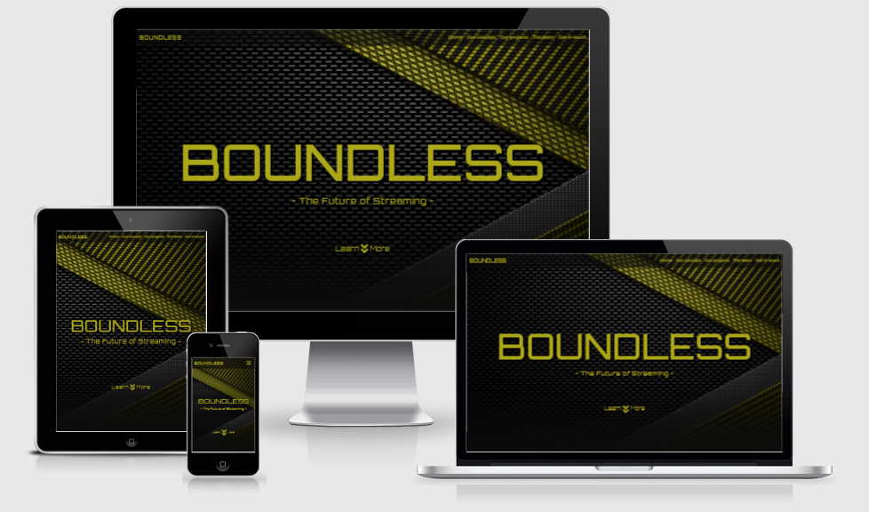
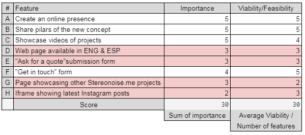
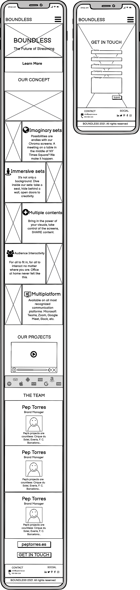
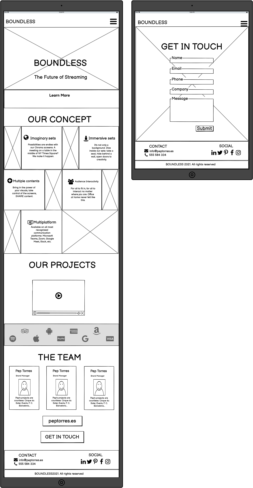

# BOUNDLESS




This website showcases the pillars forming the new concept launched by Pep Torres, BOUNDLESS.
The future of streaming is now, and this website gives you a full overview on what the service consists of and 
how it is executed, as well as media elements as an example of the service itself.
This website is mobile-first design and it's fully responsive and accessible on a vast range of devices, making it easy to navigate for all kinds of users.
 
## User Experience (UX)

### Strategy Plane
#### Target audience for BOUNDLESS:

- Users aged 15-65, given the big  amount of concept implementation possibilities, from young streamers to CEO's.
- Users interested in learning about BOUNDLESS new concept.
- Users interested in technologies, specially streaming and online communication platforms.
- Users interested in enhancing/uplifting their channel of communication by adding "out of the box" features.
- Users interested in adding creativity to any kind of project, from Media interviews to fashion events.
- Users interested in contracting BOUNDLESS services.
- Users interested in getting in touch with BOUNDLESS.
- Users interested in learning more about peptorres.es projects.

#### Research

BOUNDLESS new concept doesn't have any direct competition on the web. It's concept is dense,
therefore the goal will be to introduce this new concept to the generic public by condensing the
information in a visible and descriptive way, to help users to get familiar with the concept in the first visit.
In the future, this website could develop in a B2B (Business-to-Business) concept. However, at first we will take a B2C (Business-to-Customer) approach,
focusing on the emotional triggers such as branding and the ease of readability.

#### Business Goals

Present BOUNDLESS new concept to the users.
Present the website on a user-friendly form, where information can be absorbed easily.
Help the user understand our concept within the first visit to the website.
Connect with potential customers for future business.
Connect with potential collaborators to expand the concept and services.

#### User stories 
- ##### As a First Time Visitor, I want to...
    - Easily understand the content in order to learn about the new concept.
    - Easily navigate and find content through the website in an user-friendly way.
    - Find visual resources that support and complement the content.
    - Have the possibility to get in touch with BOUNDLESS and have access to their Social Media links.

- ##### As a Returning Visitor, I want to...
    - Find the familiar interface and layout which I already experienced.

#### Features consideration

We've used the below table to consider which features was worth adding, considering their
importance and the viability of implementing them. The ones highlighted in red were left on the side 
to be considered in the future.



### Scope Plane

Minimal Viable Product for this project is a website explaining a new concept with at least the below features;

- Navigation Bar on desktop and tablet screen, burger on mobile.
- Contact submission form
- Social Media Links

### Structure Plane
- The website has a landing main page and a "Get in touch" page.
- The user can navigate through the different sections of the landing and "Get in touch"page
using a navigation bar on desktop and tablet screen versions.
- The user can navigate through the different sections of the landing and "Get in touch"page
using a BURGER on mobile screen versions.
- The landing page is composed of a header, navigation bar, hero image, three sections and a footer.
- The "Get in touch" page is composed of a header, navigation bar, contact submission form and a footer.

### Skeleton Plane
Mobile Screen

Tablet Screen

Desktop Screen


        


### Surface Plane
This website aims to align with the look and feel of www.peptorres.es .
Nevertheless, creative design has been applied in order to not only match, but also add and adapt to this look and feel.
 
- Colors: #ADA719, #212529, #FFFFFF
- Fonts: Orbitron and Montserrat
- Images
    - The Hero image aims to highlight the brand colors and look and feel.
    - Section images aim to add value to the text displayed below.
    - Background-image aims to be visually pleasant on a contact submission form.
- Video. Video files aim to support the content of the concept area and contribute to
visual learning of the service.

## Features

### Existing Features
- Responsive on all devices: allows the user to navigate comfortably on the page regardless of the device type used.
- Navigation Bar and hamburger: allows the user to navigate through the web sections and pages with ease.
- Video section: allows the user to learn in a more visual way the concept explained in the above section.
- "Get in touch" form: allows the user to contact with Elsewhere.
- Footer: allows users to access the different social media channels of Elsewhere.

### Features Left to Implement
- Spanish page version.
- "Ask for a quote" submission form on a separate page.
- Other peptorres.es projects on a separate page.
- Iframe with the last Instagram posts by Elsewhere. 

## Technologies Used
### Languages
- HTML5
- CSS3

### Frameworks, Libraries & Programs Used
- Github: used to store the projects code.
- Git: used for version control by utilizing Gitpod.
- Bootstrap v5.0.0: used to assist with the responsiveness and styling of the website.
- Photoshop: used to edit background images.
- Balsamiq: used for wireframe design.

## Testing
### W3C Markup Validator and W3C CSS Validator

### Testing User Stories
- ##### As a First Time Visitor, I want to...
    1. Easily understand the content in order to learn about the new concept.
    - Webpage is well structured and concepts are presented clearly to the user.
    2. Easily navigate and find content through the website in an user-friendly way.
    - Navigation bar allows user to move through different sections of the website.
    3. Find visual resources that support and complement the content.
    - Images are displayed to support text, as well as video.
    4. Have the possibility to get in touch with BOUNDLESS and have access to their Social Media links.
    - Get in touch page accessible from navigation bar and button.

- ##### As a Returning Visitor, I want to...
    1. Find the familiar interface and layout which I already experienced.
    - Layout is easy to understand, user friendly and intuitive.

### Further testing
- The Website has been tested in all different screen devices from Google Developer Tools.
- The Website has been viewed on a variety of devices and screen sizes.
- The Website has been tested on Google Chrome, Internet Explorer, Safari and Microsoft Edge.
- All links have been tested.


## Deployment
### GitHub Pages

The project was deployed to GitHub Pages using the following steps...

1. Log in to GitHub and locate the [GitHub Repository](https://github.com/marctell92/boundless)
2. At the top of the Repository (not top of page), locate the "Settings" Button on the menu.
3. Scroll down the Settings page until you locate the "GitHub Pages" Section.
4. Under "Source", click the dropdown called "None" and select "Master Branch".
5. The page will automatically refresh.
6. Scroll back down through the page to locate the now published site [link](https://marctell92.github.io/boundless/) in the "GitHub Pages" section.

### Forking the GitHub Repository

By forking the GitHub Repository we make a copy of the original repository on our GitHub account to view and/or make changes without affecting the original repository by using the following steps...

1. Log in to GitHub and locate the [GitHub Repository](https://github.com/marctell92/boundless)
2. At the top of the Repository (not top of page) just above the "Settings" Button on the menu, locate the "Fork" Button.
3. You should now have a copy of the original repository in your GitHub account.

### Making a Local Clone

1. Log in to GitHub and locate the [GitHub Repository](https://github.com/marctell92/boundless)
2. Under the repository name, click "Clone or download".
3. To clone the repository using HTTPS, under "Clone with HTTPS", copy the link.
4. Open Git Bash
5. Change the current working directory to the location where you want the cloned directory to be made.
6. Type `git clone`, and then paste the URL you copied in Step 3.

```
$ git clone https://github.com/marctell92/boundless
```

7. Press Enter. Your local clone will be created.

```
$ git clone https://github.com/marctell92/boundless
> Cloning into `CI-Clone`...
> remote: Counting objects: 10, done.
> remote: Compressing objects: 100% (8/8), done.
> remove: Total 10 (delta 1), reused 10 (delta 1)
> Unpacking objects: 100% (10/10), done.
```


## Credits
- All code has strong inspiration from all learning material given by Code Institute.
- Multiple pieces of code have been taken from Bootstrap Library and modified to fit the design needs.

### Content
- README.md was strongly inspired by the Sample README from user lechien73 on GitHub, sample given by the Code Institute Mentor Team.
- Deployment section of the README.md was copied from the above mentioned Sample README.

### Media
- All images and videos were provided by BOUNDLESS.

### Acknowledgements
- BOUNDLESS team for trusting me for this project and for their professional approach.
- Code Institue Tutor Suport and Mentor Team. 